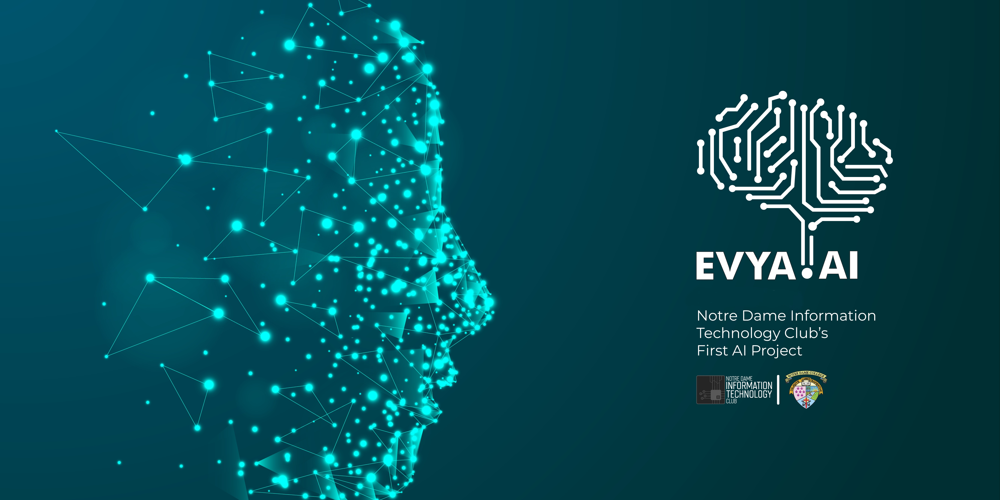
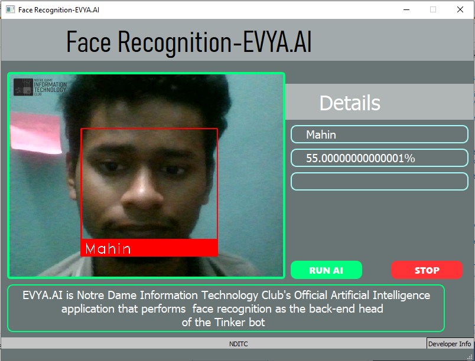

# EVYA AI - NDITC ✅
Notre Dame Information Technology Club's official Artificial Intelligence application that performs image recognition
 

## Tech Stack
 - Python==3.9
 - comtypes==1.1.14
 - dlib==19.22.99
 - face-recognition==1.3.0
 - numpy==1.24.1
 - opencv-python==4.7.0.68
 - Pillow==9.4.0
 - pypiwin32==223
 - pyttsx3==2.90
 - pywin32==305

## How to contribute?
- Start a new [issue](https://github.com/nditc/EVYA-AI/issues/new)
- Solve an existing [issue](https://github.com/nditc/EVYA-AI/issues)

 

## Credits
- Product Manager - [Abdul Basit Tonmoy](https://www.facebook.com/abasit.tonmoy)
- Face Recognition & GUI - [Mahin Bin Hasan](https://www.facebook.com/root.mahin) [Github](https://github.com/mahinbinhasan)
- Project Finalization - [Ahammad Shawki](https://linktr.ee/ahammadshawki8/)
- Image Collection - [Arko Chowdhury](https://www.facebook.com/arko.chowdhury.121)

 

## Snaps in Action

 

## License
Details can be found in [LICENSE](LICENSE)

 

## Contact Us
- [Telephone](tel:01885-925097)
- [Email](mailto:info@nditc.org)
- [Website](http://nditc.org/)
- [Facebook](https://www.facebook.com/nditc.official)
- [LinkedIn](https://www.linkedin.com/company/nditc/)
